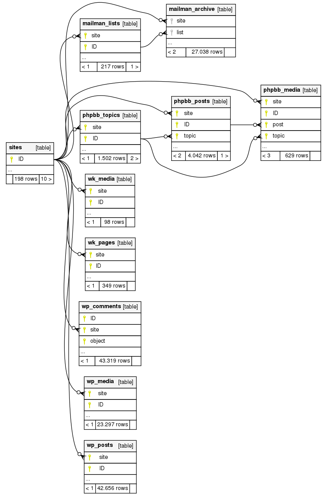

La idea es crear una copia de seguridad de la información pública
en los portales web. La misma que sacarías haciendo `scraping`, pero  aprovechando el tener acceso a la base de datos
para que sea mucho más rápido y eficiente.

Actualmente solo funciona para **wordpress** y **phpbb** pero lo deseable es que
se extienda a todos los servicios posibles.

En funcionamiento básico es el siguiente:

1. Mediante un tunel `ssh` nos conectamos a la base de datos en el servidor
2. Detectamos los esquemas que nos interesan
3. Construimos las consultas que extraigan la información pública
4. Enriquecemos la información con [`la api wordpress`](https://developer.wordpress.org/rest-api/)
5. Creamos la base de datos `SQLite` con dicha información

# Fichero de configuración y scripts

* `connect/config.yml` contiene la configuración para conectarse a la base de datos.
Obviamente no se incluye en el repositorio, pero tienes
[un ejemplo](connect/config.example.yml) con el que crear el tuyo.
* [`export.py`](export.py) se conecta a la base de datos MySQL y crea la base de datos `SQLite`
* [`release.py`](release.py) prepara las [releases](https://github.com/15hack/web-backup/releases/latest) y genera:
  * [`sites.7z`](https://github.com/15hack/web-backup/releases/latest): una copia reducida de la base de datos que genera `export.py`
  * [`out/README.txt`](out/README.md): descripción y estadística básica del contenido de
  la base de datos
  * [`out/links.txt`](out/links.txt?raw=true): listado con las urls
  de todas las páginas recuperadas para facilitar el uso por terceros
  con propósitos, como por ejemplo, hacer copias en
  [`webarchive`](https://archive.org/web/) o
  descargar los portales con [`WebHTTrack`](https://www.httrack.com/)

# Diagrama de la base de datos SQLite

